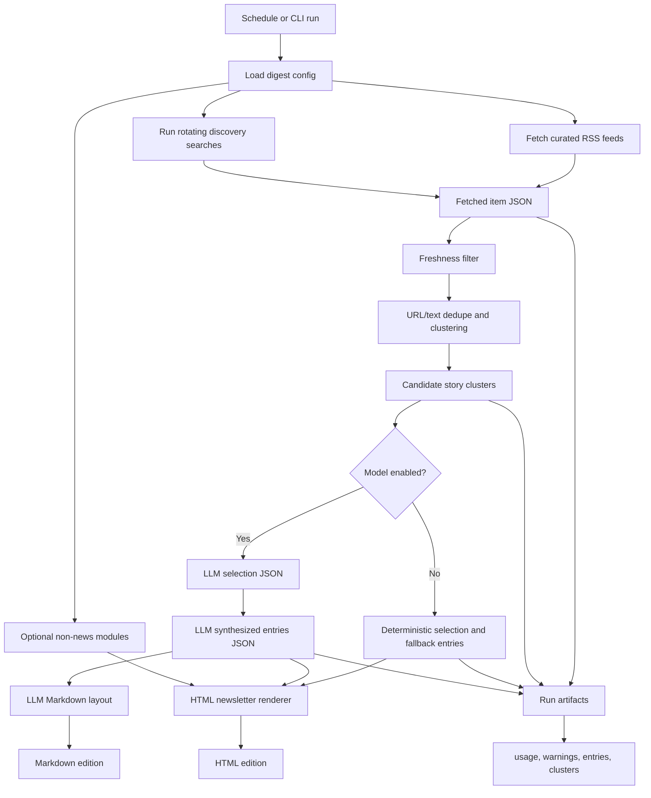

# Personalized Automated Daily Digest

This repo is a small unattended pipeline for producing a personalized daily "newspaper" from explicit fresh sources. It separates deterministic work from model judgment:

1. Fetch curated RSS feeds and rotating discovery queries.
2. Filter for freshness and cluster near-duplicate coverage.
3. Ask the model for bounded editorial choices: selection, synthesis, and final layout.
4. Write a newspaper-style HTML edition, a Markdown digest, and JSON artifacts for every stage.

The model is never asked to know what is current. It only sees fetched source metadata and excerpts from the current run.

## Flow



## Quick Start

```bash
python3 -m daily_digest.cli --config config/digest.example.json --no-model
```

With model calls:

```bash
echo "OPENAI_API_KEY=..." > .env
python3 -m daily_digest.cli --config config/digest.example.json
```

Outputs go to `out/YYYY-MM-DD-digest.html` and `out/YYYY-MM-DD-digest.md`, with auditable intermediate files in `out/YYYY-MM-DD/`.

The HTML file is the primary newsletter edition. It includes print styles, so you can open it in a browser and use Print -> Save as PDF for a paper-like PDF export.

Each run also writes `out/YYYY-MM-DD/model_usage.json` with per-model-call token counts and estimated spend. Cost estimates use the `model.pricing_usd_per_1m_tokens` values in the config, so update those rates if you change models or service tiers.

## Configuration

Copy `config/digest.example.json` and replace:

- `curated_feeds`: small recurring source list.
- `curated_feeds[].max_items`: optional per-feed cap; defaults to 10 so one noisy feed cannot dominate selection or model cost.
- `discovery.query_sets`: broad rotating query bundles, not one brittle query per topic.
- `discovery.serendipity_queries`: adjacent or unexpected topics that rotate daily.
- `publication`: stable style parameters.
- `modules`: optional non-news blocks such as `calendar_json` or `text_file`.

The Google News RSS discovery provider is intentionally a fetch adapter, not a crawler. You can add other search API adapters later without changing clustering or synthesis.

## Scheduling

Local cron example:

```cron
0 7 * * * cd "/Users/matthewpereira/Documents/News Feed" && /usr/bin/env bash scripts/run_daily_digest.sh
```

GitHub Actions is scaffolded in `.github/workflows/daily-digest.yml`. Add `OPENAI_API_KEY` as a repository secret if you want model-written digests in CI.

## Failure Behavior

Fetch failures are written as warnings and do not stop the whole run. If the model key is missing, the API is unavailable, or JSON parsing fails, the pipeline falls back to deterministic story selection and still writes HTML and Markdown editions.

## Extending Modules

Non-news sections live under `daily_digest/modules`. Add a new module loader that returns a `ModuleBlock`, then register it in `daily_digest/modules/registry.py`. Modules slot into final layout without touching fetch, dedupe, or synthesis.

## Tests

```bash
python3 -m unittest discover -s tests
```
